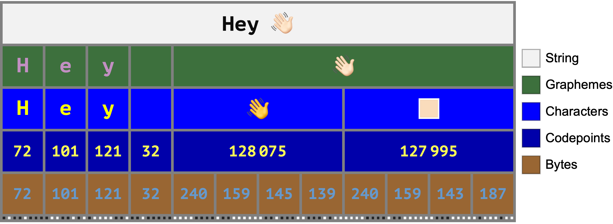

# Diagram Maker

Diagram Maker is a tool for programmatically constructing diagrams, using high-level
semantically-meaningful expressions for modeling the domain being diagramed.

[**View the Example Gallery**](https://connorgray.com/project/diagrams#example-gallery)

Example:

```wolfram
StringEncodingDiagram[
    "Hey 👋🏻",
    {"Bits", "Bytes", "Codepoints", "Characters", "Graphemes", "String"},
    CharacterEncoding -> "UTF-8",
    ChartLegends -> Automatic
]
```



## Development

See [**Development.md**](./docs/Development.md) for information on contributing to
Diagram Maker.

## Acknowledgements

* The data files in
  [assets/UnicodePublic](./crates/unicode-data/assets/UnicodePublic/)
  are sourced from <https://unicode.org/Public/> and are Copyright © Unicode, Inc.
  Used under the terms of <https://unicode.org/copyright.html>.